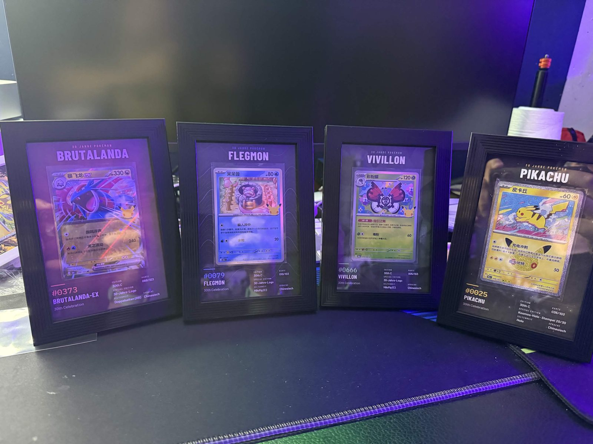
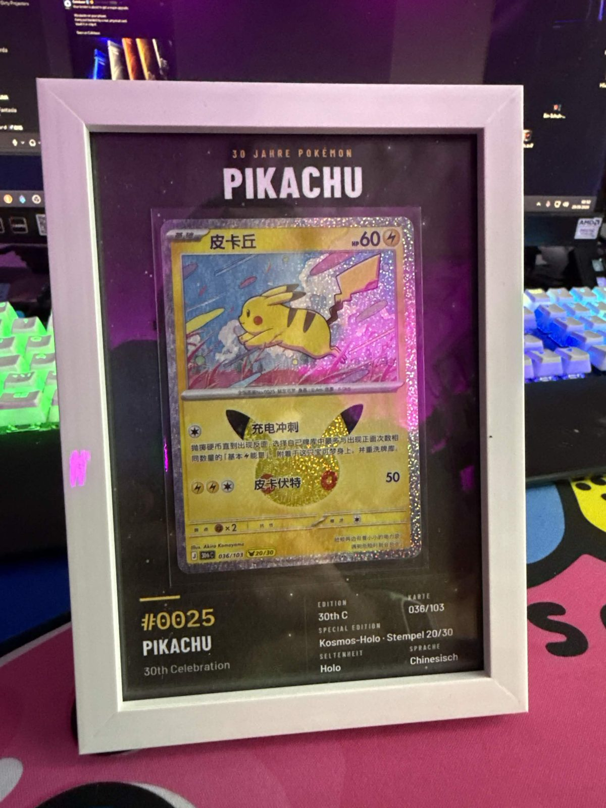
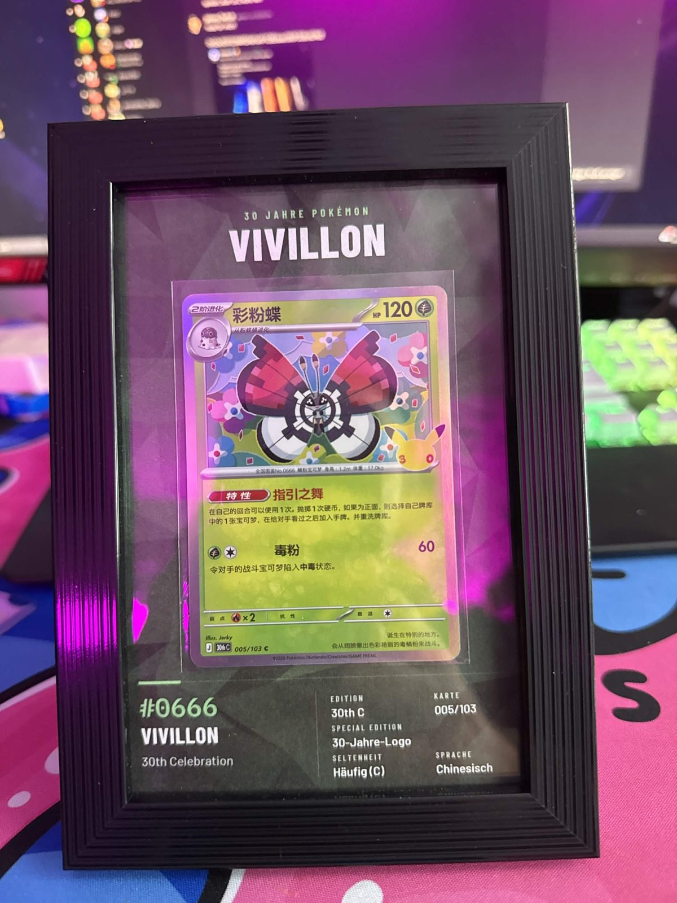
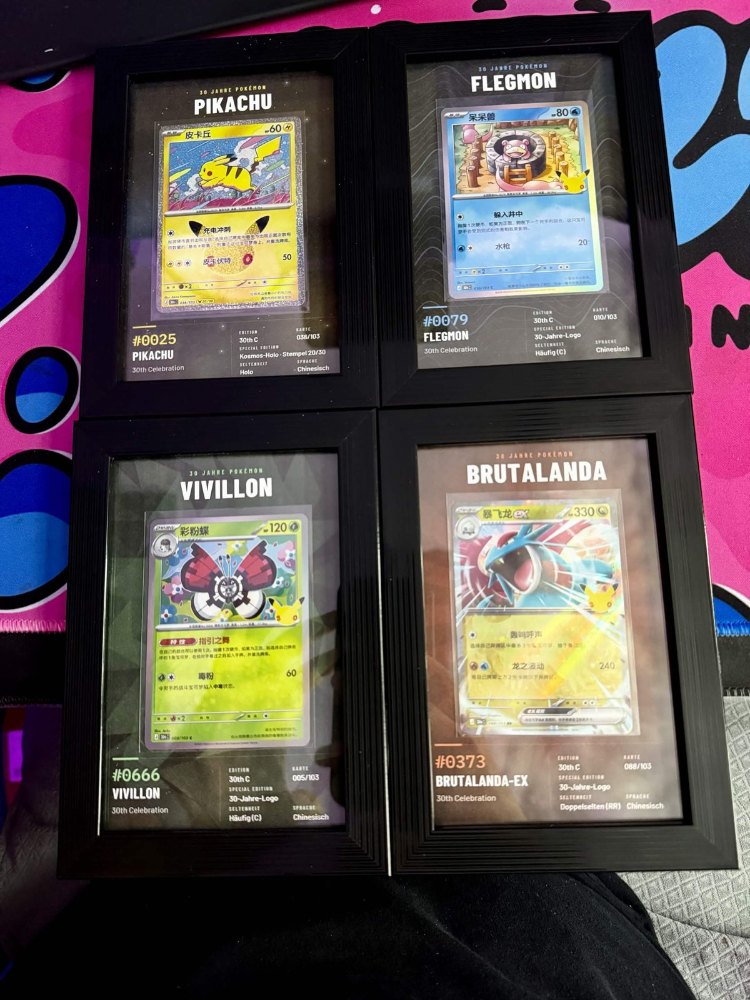
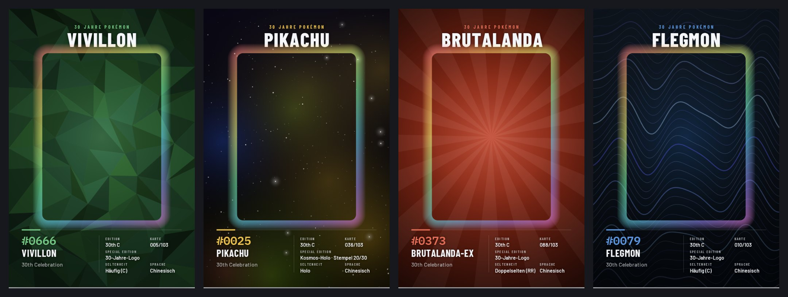
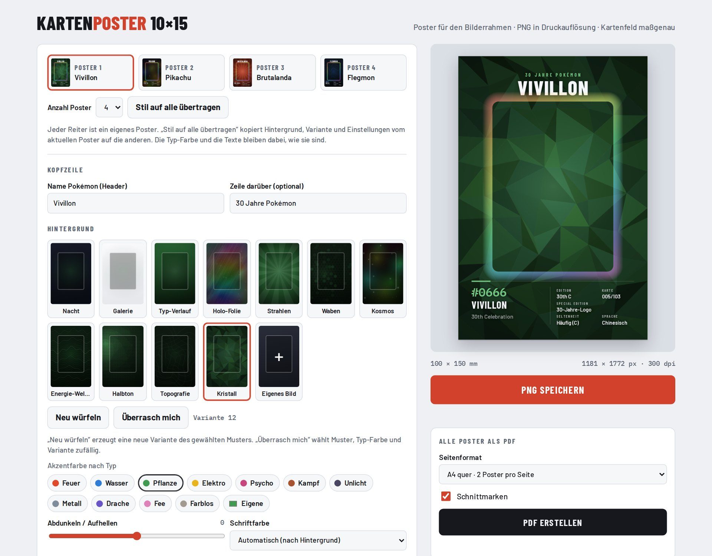
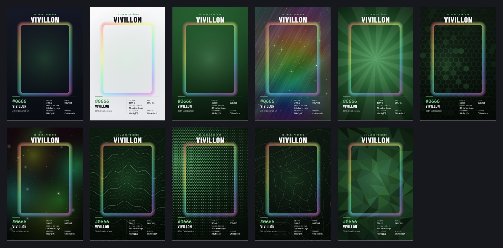
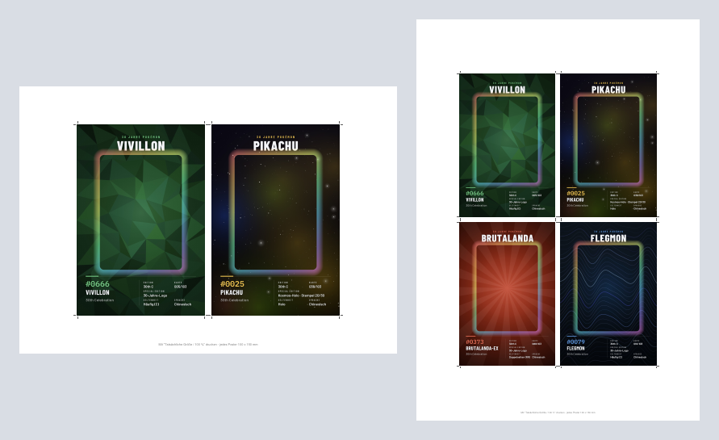

# TCG-Poster · Kartenposter 10×15

**Poster-Generator für Pokémon-Sammelkarten im 10×15-Bilderrahmen.**
Mit dem Tool gestaltest du ein Poster mit Name, Nummer und Sammler-Infos, druckst es aus und klebst die echte Karte selbst in die freie Fläche. Das Tool ist eine einzelne HTML-Datei und braucht keine Installation.

> ⚠️ **Privates Fanprojekt.** Es besteht keine Verbindung zu Nintendo, Creatures Inc., GAME FREAK oder The Pokémon Company. Nutzung auf eigene Gefahr, ohne Gewähr. Details unter [Rechtliches](#rechtliches).

---

## Inhalt

- [So sieht es fertig aus](#so-sieht-es-fertig-aus)
- [Funktionen](#funktionen)
- [Schnellstart](#schnellstart)
- [Das Tool](#das-tool)
- [Drucken und Einrahmen](#drucken-und-einrahmen)
- [Weitere Dokumentation](#weitere-dokumentation)
- [Rechtliches](#rechtliches)

---

## So sieht es fertig aus

| Pikachu im weißen Rahmen | Vivillon im schwarzen Rahmen |
|---|---|
|  |  |

Das komplette Set: *30th Celebration* (chinesische Ausgabe) mit Vivillon, Pikachu, Brutalanda und Flegmon.

So kommen die Poster aus dem Tool, also vor dem Einkleben der Karten:

---

## Funktionen

| Bereich | Was es kann |
|---|---|
| **Format** | Poster 100 × 150 mm (Hochformat), passend für handelsübliche 10×15-Bilderrahmen |
| **Kartenfeld** | Freie Fläche für die echte Karte, Standard 64 × 90 mm, einstellbar. Ohne Beschriftung und Rahmen, nur der Hintergrund läuft durch |
| **Kopfzeile** | Pokémon-Name groß, optional eine kleine Zeile darüber (z. B. „30 Jahre Pokémon“) |
| **Infoblock links** | #Nummer (Pokédex), Name, Collection |
| **Infoblock rechts** | Edition, Kartennummer, Special Edition, Seltenheit, Sprache |
| **Hintergründe** | 3 schlichte (Nacht, Galerie, Typ-Verlauf) und 8 generierte Muster (Holo-Folie, Strahlen, Waben, Kosmos, Energie-Wellen, Halbton, Topografie, Kristall) sowie ein eigenes Bild |
| **Generator** | „Neu würfeln“ erzeugt eine neue Variante des gewählten Musters, „Überrasch mich“ wählt Muster, Farbe und Variante zufällig |
| **Farbe** | Akzentfarbe nach Pokémon-Typ (Feuer, Wasser, Pflanze, …) oder frei wählbar |
| **Lesbarkeit** | Schriftfarbe hell oder dunkel automatisch nach Hintergrund, Regler zum Abdunkeln und Aufhellen, halbtransparentes Infofeld |
| **Mehrere Poster** | Bis zu 4 Poster parallel in Reitern, „Stil auf alle übertragen“ für einheitliche Sets |
| **Export** | PNG in 300 oder 600 dpi. PDF mit allen Postern: A4 quer (2 pro Seite), A3 (4 auf einer Seite) oder 10×15 (1 pro Seite), jeweils mit Schnittmarken |
| **Speichern** | Eingaben bleiben automatisch im Browser gespeichert |

---

## Schnellstart

1. **`index.html` herunterladen** und im Browser öffnen (Chrome, Edge, Firefox oder Safari).
   Alternativ über GitHub Pages online öffnen, siehe [Anleitung](docs/ANLEITUNG.md#online-nutzen-github-pages).
2. **Reiter „Poster 1“ auswählen** und Name, Nummer, Collection usw. eintragen.
3. **Hintergrund wählen** und „Neu würfeln“ drücken, bis dir eine Variante gefällt.
4. **Das Gleiche für die weiteren Poster** machen. Mit „Stil auf alle übertragen“ sehen alle gleich aus, jedes behält aber seine Typ-Farbe.
5. **„PDF erstellen“** wählen, dann mit **„Tatsächliche Größe / 100 %“** drucken.
6. Ausschneiden, Karte (am besten im Toploader) aufkleben und einrahmen.

Die ausführliche Schritt-für-Schritt-Anleitung steht in [docs/ANLEITUNG.md](docs/ANLEITUNG.md).

---

## Das Tool

Links trägst du die Daten ein, rechts siehst du die maßstabsgetreue Vorschau. Oben wechselst du zwischen den 4 Postern.

### Hintergründe

*Von links oben: Nacht, Galerie, Typ-Verlauf, Holo-Folie, Strahlen, Waben · Kosmos, Energie-Wellen, Halbton, Topografie, Kristall.* Jedes generierte Muster gibt es in beliebig vielen Varianten.

### PDF-Layouts

| Layout | Seiten bei 4 Postern | Wofür |
|---|---|---|
| **A4 quer** · 2 pro Seite | 2 | Normaler Heimdrucker |
| **A3** · 4 pro Seite | 1 | A3-Drucker oder Copyshop |
| **10×15** · 1 pro Seite | 4 | Fotodrucker oder Fotoservice (dm, Rossmann, Cewe …) |

> 4 Poster à 10×15 sind zusammen 20 × 30 cm. Auf A4 (21 × 29,7 cm) passen sie in Originalgröße **nicht** alle auf eine Seite. Deshalb gibt es A4 mit 2 Seiten oder A3.

---

## Drucken und Einrahmen

- **Druckgröße:** Immer **„Tatsächliche Größe“ / „100 %“** wählen, **nicht** „An Seite anpassen“. Sonst schrumpft das Kartenfeld und die Karte passt nicht mehr.
- **Papier:** Fotopapier (matt oder seidenmatt) sieht am besten aus. Glänzendes Papier spiegelt hinter Glas stärker.
- **Karte befestigen:** Die Karte am besten im Toploader oder in einer Hülle lassen und mit doppelseitigem Klebeband oder Klebepunkten auf die freie Fläche setzen. Nicht direkt auf die Karte kleben.
- **Rahmen:** Standard-Bilderrahmen 10×15 cm. Tiefere Rahmen (Objektrahmen) haben Platz für den Toploader, ohne dass das Glas drückt.

Mehr Tipps stehen in der [Anleitung](docs/ANLEITUNG.md#drucken).

---

## Weitere Dokumentation

| Dokument | Inhalt |
|---|---|
| [docs/ANLEITUNG.md](docs/ANLEITUNG.md) | Bedienung Schritt für Schritt, alle Felder erklärt, Drucken, Probleme und Lösungen |
| [docs/TECHNIK.md](docs/TECHNIK.md) | Aufbau des Codes, Maße und Layout, Hintergrund-Generator, Speicherung, Erweitern |
| [CHANGELOG.md](CHANGELOG.md) | Versionsverlauf |

---

## Rechtliches

**Privates Projekt.** Kartenposter 10×15 ist ein privates, nicht-kommerzielles Hobbyprojekt für die eigene Sammlung.

**Keine Verbindung zu Pokémon.** Dieses Projekt steht in **keiner Verbindung** zu Nintendo, Creatures Inc., GAME FREAK oder The Pokémon Company und wird von ihnen weder unterstützt noch gesponsert oder geprüft. Pokémon, die Namen der Pokémon und alle zugehörigen Marken und Bilder sind Eigentum ihrer jeweiligen Rechteinhaber. Die Namen werden hier nur beschreibend verwendet, um die eigene Sammlung zu beschriften. Das Tool enthält keine offiziellen Logos, Kartenbilder oder Grafiken. Alle Hintergründe werden per Code erzeugt.

**Keine Haftung.** Die Nutzung erfolgt auf eigene Gefahr. Die Software wird ohne jede Gewähr bereitgestellt, weder ausdrücklich noch stillschweigend, auch nicht für Richtigkeit, Vollständigkeit oder Eignung für einen bestimmten Zweck. Ich übernehme keine Haftung für Schäden jeglicher Art. Das gilt insbesondere für Schäden an Karten, Druckern oder Material, für Fehldrucke oder für falsche Angaben auf den Postern (Seltenheit, Edition, Kartennummer usw.). Die Angaben auf den Beispiel-Postern sind nach bestem Wissen gemacht, aber nicht offiziell geprüft.

**Fotos.** Die Fotos in `docs/images/` zeigen meine eigene Sammlung. Die abgebildeten Karten und ihre Artworks sind urheberrechtlich geschützt und gehören ihren Rechteinhabern.

**Fremdkomponenten:** [jsPDF](https://github.com/parallax/jsPDF) (MIT-Lizenz) sowie die Schriften Barlow, Barlow Condensed und IBM Plex Mono über Google Fonts (SIL Open Font License).
