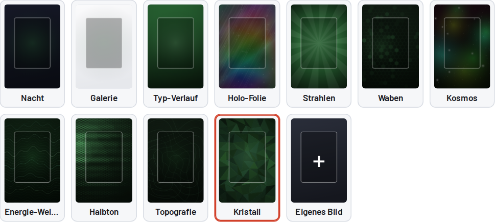

# Anleitung

Kartenposter 10×15, Bedienung Schritt für Schritt.

> Privates Fanprojekt ohne Verbindung zu Nintendo, Creatures Inc., GAME FREAK oder The Pokémon Company. Nutzung auf eigene Gefahr, ohne Gewähr. Siehe [Rechtliches](../README.md#rechtliches).

---

## Inhalt

1. [Starten](#starten)
2. [Aufbau eines Posters](#aufbau-eines-posters)
3. [Die Felder](#die-felder)
4. [Hintergrund und Farbe](#hintergrund-und-farbe)
5. [Mehrere Poster (Set)](#mehrere-poster-set)
6. [Kartenfeld](#kartenfeld)
7. [Exportieren](#exportieren)
8. [Drucken](#drucken)
9. [Einrahmen](#einrahmen)
10. [Probleme und Lösungen](#probleme-und-lösungen)

---

## Starten

### Lokal

`index.html` herunterladen und doppelklicken, dann öffnet sich die Datei im Standardbrowser. Eine Internetverbindung braucht es nur beim ersten Laden für die Schriften und die PDF-Funktion.

Empfohlen sind aktuelle Versionen von Chrome, Edge, Firefox oder Safari, am Desktop, Tablet oder Handy.

### Online nutzen (GitHub Pages)

1. Im Repo auf **Settings → Pages** gehen.
2. Unter *Build and deployment* **Source: Deploy from a branch** wählen, dann **Branch: `main`** und Ordner **`/ (root)`**.
3. Speichern. Nach etwa einer Minute läuft das Tool unter `https://<dein-name>.github.io/kartenposter/`.

GitHub Pages funktioniert nur mit einem **öffentlichen** Repo (oder mit einem kostenpflichtigen GitHub-Plan).

---

## Aufbau eines Posters

```
┌─────────────────────────────────┐   ← 100 mm breit
│         30 JAHRE POKÉMON        │   Zeile darüber (optional)
│             PIKACHU             │   Header
│     ┌─────────────────────┐     │
│     │                     │     │
│     │     freie Fläche    │     │   Kartenfeld 64 × 90 mm
│     │    für die Karte    │     │
│     │     (unsichtbar)    │     │
│     │                     │     │
│     └─────────────────────┘     │
│ ─────────────────────────────── │   Farbstrich
│ #0025      │ EDITION   KARTE    │   Infoblock
│ PIKACHU    │ SPECIAL EDITION    │
│ Collection │ SELTENHEIT SPRACHE │
└─────────────────────────────────┘   ← 150 mm hoch
```

---

## Die Felder

| Feld | Wo auf dem Poster | Beispiel | Hinweis |
|---|---|---|---|
| **Name Pokémon (Header)** | Groß oben | `Pikachu` | Wird automatisch in Großbuchstaben gesetzt und bei langen Namen verkleinert |
| **Zeile darüber** | Klein über dem Header | `30 Jahre Pokémon` | Optional. Leer lassen, dann rutscht der Header etwas nach oben |
| **#Nummer** | Links unten, farbig | `0025` | Die Raute `#` setzt das Tool selbst |
| **Name** | Links unter der Nummer | `Pikachu` | Kann vom Header abweichen, z. B. `Brutalanda-ex` |
| **Collection** | Links, klein | `30th Celebration` | Set-Name |
| **Edition** | Rechts, Zeile 1 | `30th C`, `1. Edition` | Vorschläge per Auswahlliste, freie Eingabe möglich |
| **Kartennummer** | Rechts, Zeile 1 | `036/103` | Wie auf der Karte unten links |
| **Special Edition** | Rechts, Zeile 2 | `Kosmos-Holo · Stempel 20/30` | Holo-Art, Stempel, Promo, Grading usw. Leer ergibt „—“ |
| **Seltenheit** | Rechts, Zeile 3 | `Doppelselten (RR)` | Vorschläge von Common bis Hyper Rare |
| **Sprache** | Rechts, Zeile 3 | `Chinesisch` | |

Zu lange Texte werden automatisch kleiner gesetzt, damit nichts abgeschnitten wird. Wenn ein Wert trotzdem zu klein wirkt, kürze ihn (z. B. `Doppelselten (RR)` statt `Double Rare (RR)`).

---

## Hintergrund und Farbe



### Schlichte Hintergründe

| Name | Look |
|---|---|
| **Nacht** | Dunkles Blau-Schwarz mit leichtem Farbschein |
| **Galerie** | Hell und ruhig, dunkle Schrift |
| **Typ-Verlauf** | Verlauf in der gewählten Typ-Farbe |

### Generierte Muster

| Name | Passt gut zu |
|---|---|
| **Holo-Folie** | Holo- und Rainbow-Karten |
| **Strahlen** | Action-Artworks, ex- und V-Karten |
| **Waben** | Technisch, Stahl, Elektro |
| **Kosmos** | Kosmos-Holos, Psycho, Unlicht |
| **Energie-Wellen** | Wasser, Flug, ruhige Artworks |
| **Halbton** | Retro- und Comic-Look |
| **Topografie** | Boden, Gestein, Pflanze |
| **Kristall** | Pflanze, Eis, Drache |

- **Neu würfeln** erzeugt vom gewählten Muster eine neue Variante. Die Nummer (z. B. „Variante 202“) steht daneben. Dieselbe Nummer ergibt immer genau dasselbe Bild.
- **Überrasch mich** wählt Muster, Typ-Farbe und Variante zufällig.

### Eigenes Bild

1. Auf die Kachel **Eigenes Bild** klicken, oder ein Bild in das Feld ziehen bzw. mit Strg/Cmd+V einfügen.
2. Das Bild wird randlos auf 10×15 eingepasst.
3. **Weichzeichnen** (0–10) beruhigt unruhige Fotos, damit die Karte im Vordergrund bleibt.
4. **Bildausschnitt vertikal** schiebt das Bild nach oben oder unten.

Tipp: Für den Druck sollte das Bild mindestens 1200 × 1800 Pixel haben.

### Akzentfarbe

Die Typ-Farbe (Feuer, Wasser, Pflanze, Elektro, Psycho, Kampf, Unlicht, Metall, Drache, Fee, Farblos) färbt die generierten Muster, die kleine Kopfzeile, die #Nummer und den Farbstrich. Mit **Eigene** wählst du eine beliebige Farbe.

### Lesbarkeit

| Einstellung | Wirkung |
|---|---|
| **Schriftfarbe: Automatisch** | Das Tool misst die Helligkeit hinter Header und Infoblock und wählt helle oder dunkle Schrift |
| **Abdunkeln / Aufhellen** | Legt einen schwarzen oder weißen Schleier über den Hintergrund (−60 bis +60) |
| **Infofeld hinterlegen** | Halbtransparente Fläche hinter dem Infoblock, gut bei unruhigen Mustern oder Fotos |
| **Holo-Schimmer** | Bunter Leuchtrand um das Kartenfeld. Sieht edel aus und hilft beim Anlegen der Karte. Bei Bedarf abschaltbar |

---

## Mehrere Poster (Set)


- Oben gibt es **4 Reiter**. Jeder Reiter ist ein eigenes Poster mit eigenen Texten, eigener Farbe und eigenem Hintergrund.
- Mit **Anzahl Poster** legst du fest, wie viele (1–4) ins PDF kommen.
- **Stil auf alle übertragen** kopiert vom aktuellen Poster auf alle anderen: Hintergrund-Muster, Variante, Kopfzeile, Kartenfeld-Größe und Markierung, Abdunkeln, Schriftfarbe, Infofeld, Holo-Schimmer und ein eigenes Bild. **Nicht** kopiert werden die Texte und die Typ-Farbe.

So bekommst du ein einheitliches Set, bei dem trotzdem jedes Poster seine eigene Typ-Farbe hat.

Alternativ kann jedes Poster seinen eigenen, zur Karte passenden Hintergrund bekommen. So ist das Beispiel-Set aufgebaut:

| Poster | Hintergrund | Farbe | Warum |
|---|---|---|---|
| Vivillon | Kristall | Pflanze | Rauten-Konfetti im Artwork |
| Pikachu | Kosmos | Elektro | Kosmos-Holo-Karte |
| Brutalanda | Strahlen | Feuer | Speedlines im Artwork |
| Flegmon | Energie-Wellen | Wasser | Wasser-Typ |

---

## Kartenfeld

| Einstellung | Standard | Bereich |
|---|---|---|
| Breite | 64 mm | 40–90 mm |
| Höhe | 90 mm | 60–100 mm |

Eine Pokémon-Karte ist 63 × 88 mm groß. Im Toploader sind es etwa 76 × 101 mm, im Perfect-Fit-Sleeve etwa 64 × 89 mm. Die freie Fläche ist bewusst **unsichtbar**, die Karte klebst du selbst auf. Falls du doch eine Hilfe möchtest, gibt es bei **Markierung für die Karte** folgende Optionen:

- **Keine (unsichtbar)**, Standard
- **Nur Eckmarken**: kleine Winkel an den Ecken
- **Passepartout-Linie außen**: feine farbige Linie als Rahmen
- **Gestrichelte Linie**: Klebehilfe

**Kartenfoto (nur Vorschau):** Du kannst ein Foto der Karte laden und damit prüfen, wie das Poster fertig wirkt. Ins PNG und ins PDF kommt es nur, wenn du „Kartenfoto auch ins PNG übernehmen“ anhakst. Standardmäßig bleibt die Fläche leer, weil dort die echte Karte hinkommt.

---

## Exportieren

### PNG (einzelnes Poster)

**PNG speichern** exportiert das gerade offene Poster.

| Auflösung | Pixel | Wofür |
|---|---|---|
| 300 dpi | 1181 × 1772 | Fotodruck, Standard |
| 600 dpi | 2362 × 3543 | Sehr scharfe Drucke, große Dateien |

Das PNG hat exakt 10 × 15 cm. Du kannst es direkt beim Fotoservice (dm, Rossmann, Cewe usw.) als 10×15-Abzug bestellen.

### PDF (alle Poster)

Unter **Alle Poster als PDF** Seitenformat wählen, dann **PDF erstellen**.

| Format | Anordnung | Ränder |
|---|---|---|
| **A4 quer** | 2 Poster nebeneinander, 6 mm Abstand | ca. 45 mm links/rechts, 30 mm oben/unten |
| **A3** | 2 × 2 Poster, 6 mm Abstand | ca. 45 mm links/rechts, 57 mm oben/unten |
| **10×15** | 1 Poster pro Seite, randlos | keine |

**Schnittmarken** sind kleine Linien an den Ecken jedes Posters. Beim 10×15-Format gibt es keine, da die Seite schon das Poster ist.

---

## Drucken

1. PDF öffnen (Acrobat Reader, Browser oder Vorschau am Mac).
2. Im Druckdialog **Seitengröße: „Tatsächliche Größe“** bzw. **Skalierung: 100 %** wählen.
   ❌ **Nicht** „An Seite anpassen“, „Anpassen“ oder „Übergroße Seiten verkleinern“.
3. Papierformat passend zum PDF wählen (A4 quer, A3 oder 10×15).
4. Qualität auf **Hoch** oder **Foto** stellen.
5. **Probedruck auf Normalpapier:** Karte auflegen und prüfen, ob sie passt. Dann erst auf Fotopapier drucken.

**Papier:** Fotopapier matt oder seidenmatt, 180–260 g/m². Glänzendes Papier spiegelt hinter Glas stärker.

**Ausschneiden:** Mit Cutter und Metalllineal entlang der Schnittmarken, auf einer Schneidematte. Ein Hebelschneider oder Rollschneider geht noch schneller und genauer.

---

## Einrahmen

- **Rahmen:** Standard-Bilderrahmen für 10×15 cm (Innenmaß = Fotomaß).
- **Karte im Toploader:** Tiefe Rahmen (Objektrahmen, 3D-Rahmen) oder Rahmen ohne Glas nehmen. Sonst drückt das Glas auf den Toploader.
- **Befestigen:** Doppelseitige Klebepunkte oder Klebeband auf die **Rückseite des Toploaders oder der Hülle**, nie direkt auf die Karte.
- **Mittig setzen:** Mit dem Holo-Schimmer oder einer Eckmarken-Markierung als Orientierung geht das leichter.
- **Licht:** Keine direkte Sonne. UV bleicht Poster und Karten aus.

---

## Probleme und Lösungen

| Problem | Ursache | Lösung |
|---|---|---|
| Karte passt nicht ins Feld / Poster ist zu klein | Beim Drucken wurde skaliert | „Tatsächliche Größe / 100 %“ einstellen |
| Druck hat einen weißen Rand oder ist abgeschnitten | Drucker kann nicht randlos drucken | A4- oder A3-Layout mit Schnittmarken nutzen und ausschneiden |
| Schrift ist schlecht lesbar | Hintergrund zu unruhig oder zu hell | „Abdunkeln“ erhöhen oder „Infofeld hinterlegen“ anhaken |
| Schrift sieht anders aus als in der Vorschau | Schriften konnten nicht laden (offline) | Mit Internetverbindung neu laden |
| „PDF-Baustein konnte nicht geladen werden“ | Keine Verbindung zu cdnjs | Internetverbindung prüfen, Seite neu laden |
| Eingaben sind weg | Browserdaten gelöscht oder privater Modus | Eingaben werden nur im Browser gespeichert. PNG oder PDF als Sicherung aufheben |
| Eigenes Bild ist nach Neuladen weg | Bild war zu groß für den Browser-Speicher | Kleineres Bild verwenden (unter ca. 3 MB) |
| Datei wird nicht heruntergeladen | Popup- oder Download-Blocker | Download im Browser erlauben |

---

← Zurück zur [Übersicht](../README.md) · Weiter zur [Technik](TECHNIK.md)
